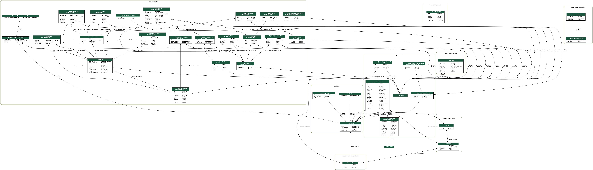

# Tapir Member & Subscription Management System

Tapir is a member and subscription management system to be used by [WirGarten e.V](https://www.wirgarten.com/).

Tapir [has a trunk](https://www.youtube.com/watch?v=JgwBecM_E6Q), but not quite such a beautiful one as
[Mme. l'élephan](https://github.com/elefan-grenoble/gestion-compte). Tapir is badass,
[but not quite as badass as the other
animals](https://www.youtube.com/watch?v=zJm6nDnR2SE). Let's teach Tapir some tricks!

## Getting started

    docker-compose up

This starts a container with an LDAP server and automatically loads the test data into the LDAP.

Next, set up the test database and load test data

    # Create tables
    docker-compose exec web poetry run python manage.py migrate
    
    # Import master data
    docker-compose exec web ./import-masterdata.sh

    # Import configuration parameter definitions
    docker-compose exec web poetry run python manage.py parameter_definitions

    # Load admin (password: admin) account
    docker-compose exec web poetry run python manage.py loaddata admin_account
    
    # Load lots of test users
    docker-compose exec web poetry run python manage.py populate --reset_all

### Django Shell

    docker-compose exec web poetry run python manage.py shell_plus

### LDAP

For reading or modifying the LDAP, Apache Directory Studio is pretty handy.

### Running tests

For running the test should have a clean openldap container with the test data.

    docker-compose up -d openldap

Then, run the tests.

    docker-compose run web poetry run pytest


#### Selenium Tests

You can connect to the selenium container via VNC for debugging purpose. The address is localhost:5900, password :
secret

### Model

[](https://raw.githubusercontent.com/FoodCoopX/wirgarten-tapir/master/models.png)

#### Generate Class Diagram

Run the following command to generate a class diagram: \
`docker-compose exec web sh -c "apt install -y graphviz graphviz-dev && poetry run pip install pygraphviz && poetry run python manage.py graph_models -a -g -o models.png"`

### Vocabulary

A few definitions to help newcomers understand the model classes.

| Class          | Definition                                                                                                                                                                                                 |
|----------------|------------------------------------------------------------------------------------------------------------------------------------------------------------------------------------------------------------|
| ShareOwnership | Represents a person that is owning at least one share.                                                                                                                                                     |
| TapirUser      | Represents a person with a user account. Accounts are linked between Tapir and the Wiki for example. Gets created when the member becomes active (part of the shift system etc.), but can become inactive. |  

### Translations

To generate the translation files, first use "makemessages" and specify the language you want to generate:

    docker-compose exec -w /app/tapir web poetry run python ../manage.py makemessages -l de

Update tapir/translations/locale/de/LC_MESSAGES/django.po with your translations.

For the changes to take effect, restart the Docker container. This will run `manage.py compilemessages` automatically.

### Configuration Parameters

We have introduced a generic way to configure the application with key-value pairs.

Currently the datatypes `string`, `float`, `integer` and `boolean` are supported.

You can retrieve parameter values in Python in the following way:

``` python
from tapir.configuration.parameter import get_parameter_value
from tapir.wirgarten.parameters import Parameter

get_parameter_value(Parameter.SITE_NAME) # --> WirGarten Lüneburg eG
```

There is also a template tag available for reading parameter values:

``` html


{{ 'wirgarten.coop.site_name' | parameter }}
```

#### How to define parameters

Best practice for those parameters is to create a `<app>/parameters.py` file per app.

It contains constants for parameter names and categories (so it is easy to find usages in the IDE), and the actual
parameter definitions (with a description, initial value, datatype).

When running the `manage.py parameter_definitions` command, all instances of `TapirParameterDefinitionImporter` will be
found and imported through the `import_definitions()` function.

The key should have the following format: `<app>.<category>.<name>`

Example (see [wirgarten/parameters.py](tapir/wirgarten/parameters.py) for the full example):

``` python
# Constants for parameter categories
class ParameterCategory:
    SITE = "Standort"
    # [...]

# Constants for parameter names
class Parameter:
    SITE_NAME = "wirgarten.site.name"
    SITE_EMAIL = "wirgarten.site.email"
    HARVEST_SHARES_SUBSCRIBABLE = "wirgarten.harvest.harvest_shares_subscribable"

    # [...]

# Parameter definitions (for automatic import)
class ParameterDefinitions(TapirParameterDefinitionImporter):
    def import_definitions(self):
        
        parameter_definition(
            key=Parameter.SITE_NAME,
            datatype=TapirParameterDatatype.STRING,
            initial_value="WirGarten Lüneburg eG",
            description="Der Name des WirGarten Standorts. Beispiel: 'WirGarten Lüneburg eG'",
            category=ParameterCategory.SITE,
            order_priority=1000,
        )

        parameter_definition(
            key=Parameter.SITE_EMAIL,
            datatype=TapirParameterDatatype.STRING,
            initial_value="lueneburg@wirgarten.com",
            description="Die Kontakt Email-Adresse des WirGarten Standorts. Beispiel: 'lueneburg@wirgarten.com'",
            category=ParameterCategory.SITE,
            order_priority=900,
            meta=ParameterMeta(
                validators=[EmailValidator()]
            )
        )
        
        parameter_definition(
            key=Parameter.HARVEST_SHARES_SUBSCRIBABLE,
            label="Ernteanteile zeichenbar",
            datatype=TapirParameterDatatype.INTEGER,
            initial_value=1,
            description="Wenn aktiv, dann sind Enteateile von Mitgliedern zeichenbar.",
            category=ParameterCategory.HARVEST,
            meta=ParameterMeta(
                options=[
                    ( 2, "automatisch"),
                    ( 1, "zeichenbar"),
                    ( 0, "nicht zeichenbar"),
                ]
            )
        )
        
        # [...]
```

if `order_priority` (type `int`) is provided, the item will be placed \
at the beginning of the category, with high `order_prority` values first.
Items which do not provide `order_priority` will be ordered alphabetically after those which provide the attribute.

#### ParameterMeta

The `meta` attribute can be set for advanced configuration.

`options` is defined as array of 2-tuple \
which elements are defined as `(value, label)` pairs, \
with `value` of type `TapirParameterDatatype` \
and `label` of type `string`. \
The programmer has to make sure, the value of `value` is **never** `None`

`validators` is an array of `callable`s, this means you can pass any function or Django Validator. Useful Django
valdators are `EmailValidator`, `MinValueValidator`, `MaxValueValidator`, `RegexValidator`, `URLValidator`.

#### UI

A simple UI for editing parameter values can be found under "Administration -> Configuration" (permission: `coop.admin`)
.
The parameters are grouped by the category.


### Modal Forms
We have the possibility to use Django Forms in Bootstrap modals.


**Example:**
#### 1) Define the view
views.py
``` python
# make sure your function signature is the same -> your_function(request, **kwargs)
def get_product_type_edit_form(request, **kwargs):
    return get_form_modal(
        request=request,
        
        # your form class (not instance!!)
        form=ProductTypeForm, 
        
        # the handler is called if the form is submitted and valid
        handler=lambda form: save_product_type(form.cleaned_data), # the handler will be called on success
        
        # This callback function creates the redirect url.
        # The result of the handler function is passed, so you could include the ID for newly generated entities
        redirect_url_resolver=lambda data: f"""{reverse_lazy(PAGE_ROOT)}?{request.environ["QUERY_STRING"]}""",
        **kwargs,
```

#### 2) Add URL routing for the view
urls.py
``` python
    # [...]
    
    path(
        "product/<str:periodId>/typeadd",
        get_product_type_edit_form, # this is the function from above
        name="product_type_edit",
    ),
    
    # [...]
```

#### 3) Show the modal on button click
``` html
  <button onclick="FormModal.load(view_url, title)">
    Open Modal        
  </button>
```
